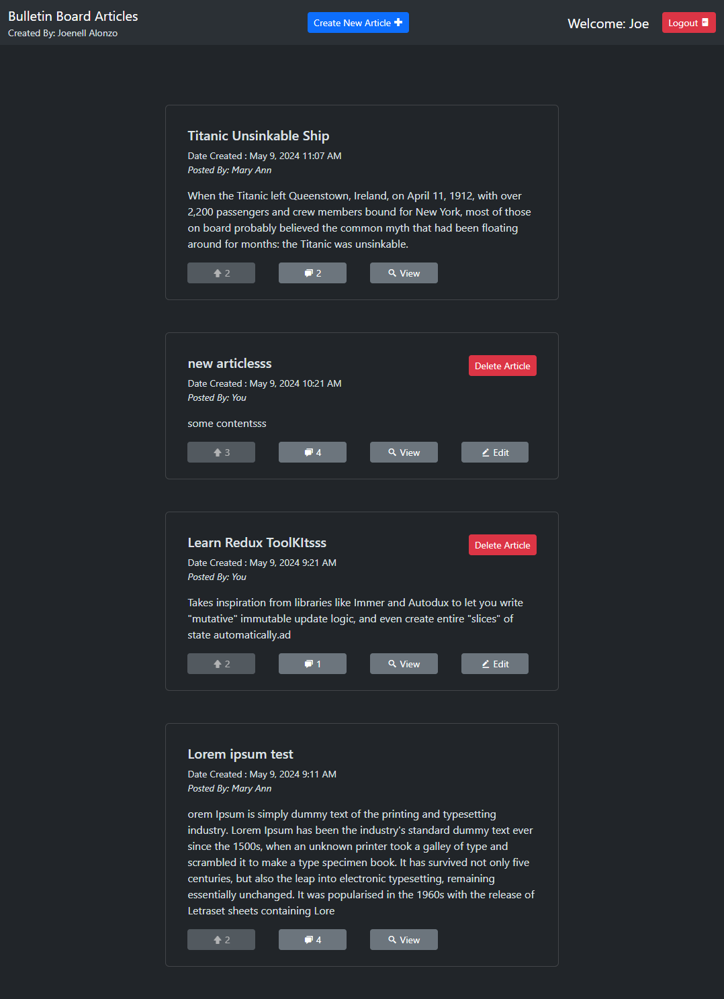

# Bulletin Board with comments, voting, and authentication

## Features

- User Registration: Allows users to register and authenticate, generating a JWT Token stored in localStorage.
- Article List: Displays a list of articles in the bulletin.
- CRUD Operations on Articles: Create, Update, and Delete articles.
- Voting: Users can cast votes on articles in the bulletin board.
- Comments: Users can add comments to the articles listed in the bulletin board.
- Logout: Functionality to destroy the token and remove data from localStorage.

## Screenshots

## Technologies and Frameworks Used

- HTML5
- CSS3
- Sweetalert
- VueJS
- Laravel

## Repos in Development Mode

Frontend: [front_end](https://github.com/alonzojoe/article_frontend.git)

Backend: [back_end](https://github.com/alonzojoe/article_backend.git)
